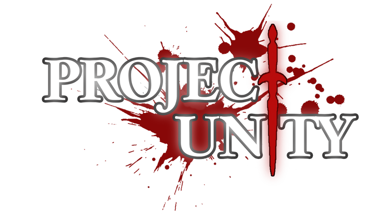

# :dagger: Project Unity

## :mag: Overview

> In the sprawling city of Manila, a retired-detective was invited into a gala party by an old associate. The party is being held at a secluded grand mansion and attended by the rich and powerful individuals from around the city. The lovely atmosphere of the party changes when a murder occurs in front of everyone. Now it is up to the detective to take charge of the situation and solve the mystery. Using all his wits and skills, he sets out to unravel the web of lies and deception and reveal the truth.

Project Unity (_placeholder title_) is a short Visual-Novel-styled game created in the Godot Engine, created for CS 192. The player takes the role of a retired detective being invited into a party by one of his associates; which devolves into a murder-mystery case after one of its guests have been killed. This text-heavy, fully-voiced game will take you on a ride that parallels Philippine's societal issues—as well as its own problems of the self.

This is a course requirements for CS191/192 Software Engineering Courses of the Department of Computer Science, College of Engineering, University of the Philippines, Diliman under the guidance of Ma. Rowena C. Solamo for AY 2022-2023.

## :busts_in_silhouette: Members:

- [DIAZ, Ralph Bryllemond Y.](https://github.com/Bourbon-Rye)
- [OMISOL, Michael Sean Brian B.](https://github.com/FlamingHerb)
- [LOGROÑO, Brylle Joshua B.](https://github.com/d1w1rm4)

## :arrow_down: Download

[A debugging demo is available in Netlify by pressing this convenient link to it.](https://cs192-project-unity.netlify.app/)

## :scroll: License

Distributed under the GNU GPL v3.0 License. See `LICENSE` for more information.
